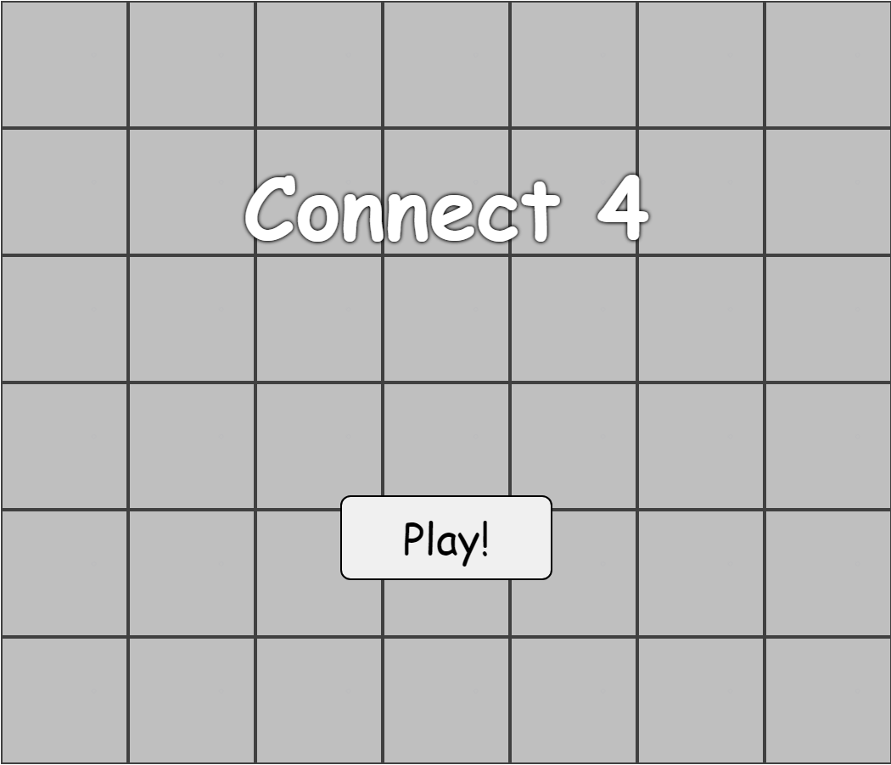
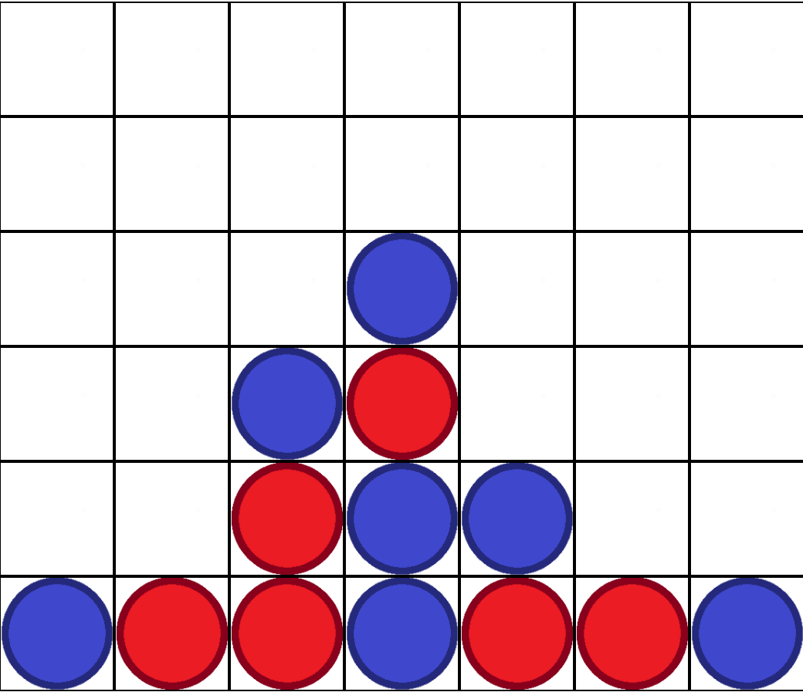

<h1>Connect 4 in JavaScript</h1>
https://jasondinh345.github.io/Connect-4/ 
<h4>This a connect 4 game for local play only. Players 1 is always blue and Player 2 is always red, where Player 1 goes first.</h4>

<h2>Learned</h2>
<ul>
  <li>Basic JavaScript, HTML, and CSS</li>
  <li>Manipulating HTML and CSS elements in JS</li>
  <li>Using the .addEventListener function</li>
  <li>Utilizing a grid in CSS</li>
</ul>
<h2>Additional Things I Could Add/Improve</h2>
<ul>
  <li>Incorporating a win track for each player</li>
  <li>Tracker for whose turn it its</li>
  <li>Somehow connecting this to a server to allow online play</li>
  <li>Adding animation and sound when the colored chip is placed down</li>
</ul>
<h2>Known Issues</h2>
<li>Elements not adjusting to a minimized window</li>
